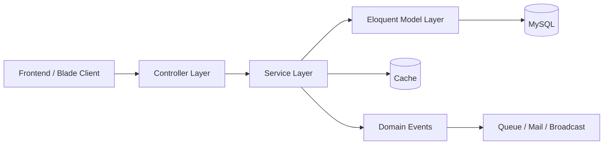
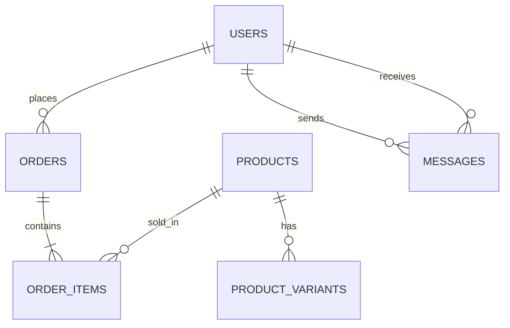

# NovaShop

Technical-focused Laravel 12 e-commerce system used to demonstrate backend design choices, trade-offs, and implementation depth.

**Repository:** [https://github.com/KienCuongSoftware/NovaShop](https://github.com/KienCuongSoftware/NovaShop)

## Architecture

- Monolithic Laravel application, modularized by domain (`User`, `Admin`, `Staff`)
- Layered flow: `Controller -> Service -> Model`
- Event-driven pieces for side effects (`OrderObserver`, `MessageSent`)
- Realtime communication via broadcasting channels (`chat.user.{id}`)
- Core services:
  - `OrderPlacementService`
  - `CouponService`
  - `ShippingFeeService`
  - `ProductSearchService`



## Key Technical Decisions

- Search strategy: database search as baseline + optional Elasticsearch
  - simpler local setup
  - scalable search path without changing business flow
- Queued back-in-stock notifications
  - avoids blocking request lifecycle
  - better reliability for high-volume mail
- Shipping by Haversine distance (internal coordinates)
  - no external API dependency
  - deterministic fee calculation
- OTP-gated sensitive flows (password change, account delete, account restore)
  - reduces account takeover risk
  - keeps critical actions auditable
- Soft delete for `users` with controlled restore flow
  - preserves data integrity across orders/payments/reviews

## Authentication and Account Security Flow

1. Register with email/password
2. Verify email via OTP
3. Complete onboarding (name -> avatar)
4. Sensitive actions require extra OTP:
   - password change
   - account deletion
   - account restoration
5. Deleted account login path:
   - explicit restore prompt
   - restore OTP verification

## Database Design

### Core Entities

- `users` (role flags, OTP fields, soft delete `deleted_at`)
- `orders`, `order_items`, `payments`
- `products`, `product_variants`, `inventory_logs`
- `coupons`
- `messages` (livechat persistence + unread state)

### Key Relationships

- One `User` -> many `Orders`
- One `Order` -> many `OrderItems`
- One `Product` -> many `ProductVariants`
- One `User` <-> many `Message` as sender/receiver



## Request Lifecycle (Example: Place Order)

1. Client submits checkout request
2. Controller validates input and forwards to `OrderPlacementService`
3. Service:
   - validates cart state and coupon
   - checks stock availability
   - calculates pricing and shipping
4. Database transaction:
   - creates `order` + `order_items`
   - updates inventory
5. `OrderObserver` triggers:
   - email notification
   - inventory logs
6. Response returned to client

## Core Backend Challenges

### 1) Coupon Validation Engine

- Handles multiple constraints together:
  - VIP / first-order / birthday windows
  - category scope and descendant matching
  - minimum order and usage limits
- Enforced twice:
  - cart pricing stage
  - final order placement stage

### 2) Inventory Consistency

- Stock changes on checkout and cancellation/return scenarios
- Inventory movement logging for traceability
- Staff-side manual adjustments integrated into logs

### 3) Realtime Chat System

- WebSocket-based chat (Laravel Echo + Reverb/Pusher)
- Private per-user channels for message isolation
- Unread counter synchronization for both user and admin views

## Concurrency Handling

- Potential issue:
  - concurrent checkout on the same SKU/variant
- Current approach:
  - stock validation before final order placement
- Limitation:
  - race condition is still possible under high contention
- Failure scenario:
  - two users place an order at the same time with the last remaining stock
  - both pass validation before DB commit
- Next improvements:
  - DB row-level locking (`SELECT ... FOR UPDATE`)
  - atomic decrement / optimistic locking pattern

## Performance Optimization

- Optional Elasticsearch to offload heavy search workloads
- Caching for frequently accessed catalog context (`CatalogCache`)
- Database indexes in critical flows (including chat sender/receiver + timestamp)
- Queue-based background handling for email-heavy notifications
- Use selective eager loading to reduce N+1 queries in product and order flows

## Trade-offs

- Monolith instead of microservices
  - easier iteration and deployment
  - harder independent scaling by bounded context
- DB-first search fallback instead of Elasticsearch-only
  - lower operational complexity
  - weaker relevance and scaling characteristics
- Synchronous order status email
  - immediate delivery behavior without queue dependency
  - adds response-time overhead to status updates

## API / Endpoint Example

This project is web-first (Blade + web routes), but chat and some flows expose JSON endpoints:

- `POST /user/chat/send`
- `GET /user/chat/messages`
- `GET /admin/chat/users`
- `GET /admin/chat/messages/{userId}`

Example payload:

```json
{
  "message": "Xin chao"
}
```

## High-Level Feature Scope

- Storefront: catalog, cart, checkout, orders, reviews
- Security flows: OTP verification, OTP-gated profile actions, soft-delete restore lifecycle
- Admin: catalog/promotion/user management + support chat
- Staff: order operations, review moderation, inventory adjustments/logs, activity log
- Integrations: PayPal, Google OAuth, OpenAI assistant, realtime chat

## Project Structure

- `app/Http/Controllers/User`, `Admin`, `Staff`
- `app/Services`
- `app/Models`
- `app/Events/MessageSent.php`
- `app/Observers/OrderObserver.php`
- `routes/web.php`, `routes/channels.php`
- `config/broadcasting.php`, `config/reverb.php`

## Requirements

- PHP ^8.2
- Composer
- MySQL (or Laravel-supported DB)
- Node.js + npm (optional, for Vite assets)

## Setup and Run

```bash
git clone https://github.com/KienCuongSoftware/NovaShop.git
cd NovaShop
composer install
cp .env.example .env
php artisan key:generate
php artisan migrate
php artisan storage:link
```

Set `DB_*` and other needed `.env` keys (`MAIL_*`, `PAYPAL_*`, `GOOGLE_*`, `OPENAI_*`, `REVERB_*`).

Run app:

```bash
php artisan serve
```

Development stack:

```bash
composer run dev
php artisan reverb:start
```

## Testing

```bash
php artisan test
```

## Code Style

```bash
./vendor/bin/pint
```

## License

Open-sourced under the [MIT License](LICENSE).
